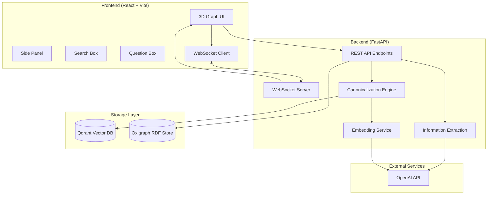

# Design Document

## Overview

The AI Knowledge Mapper POC is a real-time knowledge graph system that demonstrates automated knowledge extraction, canonicalization, and interactive visualization. The system follows a microservices architecture with a Python FastAPI backend handling LLM operations and graph storage, and a React frontend providing 3D visualization and user interaction.

The core workflow involves: text ingestion → chunking → LLM-based information extraction → entity canonicalization via vector similarity → storage in graph and vector databases → real-time streaming to frontend → interactive 3D visualization with question-answering capabilities.

## Architecture

### System Architecture Diagram



### Technology Stack

**Backend:**
- Python 3.11 with FastAPI for REST API and WebSocket handling
- Pydantic for data validation and serialization
- Uvicorn as ASGI server
- Qdrant for vector similarity search and entity canonicalization
- Oxigraph for RDF triple storage and SPARQL queries
- OpenAI API for LLM information extraction and embeddings

**Frontend:**
- React 18 with TypeScript for type safety
- Vite for fast development and building
- react-force-graph-3d for 3D graph visualization
- Zustand for state management
- react-use-websocket for real-time updates
- Tailwind CSS for styling
- Framer Motion for smooth animations

**Infrastructure:**
- Docker for containerization
- Docker Compose for orchestrating services
- WSL2 for Windows development environment

## Components and Interfaces

### Backend Components

#### 1. FastAPI Application (`server.py`)
- **Purpose:** Main application entry point and route definitions
- **Responsibilities:** Request routing, WebSocket management, CORS handling
- **Key Routes:**
  - `POST /ingest` - Text ingestion and processing
  - `GET /search` - Vector similarity search
  - `GET /neighbors` - Graph neighborhood expansion
  - `GET /ask` - Question answering with citations
  - `GET /graph/export` - Graph data export
  - `WebSocket /stream` - Real-time updates

#### 2. Information Extraction Service (`ie_service.py`)
- **Purpose:** LLM-based entity and relationship extraction
- **Responsibilities:** Text chunking, prompt engineering, JSON parsing
- **Key Methods:**
  - `chunk_text(text: str) -> List[str]` - Split text into processable chunks
  - `extract_entities_relations(chunk: str) -> IEResult` - LLM extraction
  - `validate_ie_output(raw_json: str) -> IEResult` - JSON validation

#### 3. Canonicalization Engine (`canonicalization.py`)
- **Purpose:** Entity deduplication and merging
- **Responsibilities:** Vector similarity, alias matching, entity merging
- **Key Methods:**
  - `find_similar_entities(entity: Entity) -> List[Entity]` - ANN search
  - `should_merge(entity1: Entity, entity2: Entity) -> bool` - Merge decision
  - `merge_entities(entities: List[Entity]) -> Entity` - Entity consolidation

#### 4. Storage Adapters
- **Qdrant Adapter (`storage/qdrant_adapter.py`):**
  - Vector storage and similarity search
  - Entity embedding management
  - Collection initialization and configuration
  
- **Oxigraph Adapter (`storage/oxigraph_adapter.py`):**
  - RDF triple storage
  - SPARQL query execution
  - Graph neighborhood expansion

#### 5. WebSocket Manager (`websocket_manager.py`)
- **Purpose:** Real-time client communication
- **Responsibilities:** Connection management, message broadcasting
- **Message Types:**
  - `upsert_nodes` - Node additions/updates
  - `upsert_edges` - Edge additions/updates
  - `status` - Processing status updates

### Frontend Components

#### 1. App Component (`App.tsx`)
- **Purpose:** Main application layout and routing
- **Responsibilities:** Layout management, global state initialization
- **Layout:** Header with controls, main graph view, collapsible side panel

#### 2. Graph3D Component (`Graph3D.tsx`)
- **Purpose:** 3D graph visualization and interaction
- **Responsibilities:** Node/edge rendering, user interaction handling, WebSocket updates
- **Key Features:**
  - Force-directed layout with customizable physics
  - Node sizing based on salience scores
  - Edge width based on confidence scores
  - Hover tooltips and click selection

#### 3. SidePanel Component (`SidePanel.tsx`)
- **Purpose:** Detailed node information display
- **Responsibilities:** Node metadata, evidence quotes, neighborhood expansion
- **Sections:**
  - Node summary and metadata
  - Evidence quotes with source references
  - Related entities and relationships
  - Expand neighborhood controls

#### 4. SearchBox Component (`SearchBox.tsx`)
- **Purpose:** Entity search and navigation
- **Responsibilities:** Search query handling, result display, graph navigation
- **Features:**
  - Autocomplete suggestions
  - Vector similarity search
  - Result highlighting and selection

#### 5. QuestionBox Component (`QuestionBox.tsx`)
- **Purpose:** Question-answering interface
- **Responsibilities:** Question input, answer display, citation handling
- **Features:**
  - Natural language question input
  - Grounded answer display
  - Clickable citations linking to graph nodes

#### 6. State Management (`store/useStore.ts`)
- **Purpose:** Global application state
- **State Objects:**
  - `nodes: Map<string, UINode>` - Graph nodes
  - `edges: Map<string, UIEdge>` - Graph edges
  - `selectedNode: string | null` - Current selection
  - `searchResults: SearchResult[]` - Search results
  - `currentAnswer: QAResult | null` - Latest Q&A result

## Data Models

### Core Entity Models

```typescript
interface Entity {
  id: string;                    // SHA256 hash of name|type
  name: string;                  // Canonical entity name
  type: EntityType;              // Concept|Library|Person|Org|Paper|System|Metric
  aliases: string[];             // Alternative names
  embedding: number[];           // Vector representation (3072-dim)
  salience: number;              // Importance score [0,1]
  source_spans: SourceSpan[];    // Text provenance
  summary: string;               // 30-word description
  created_at: string;            // ISO-8601 timestamp
  updated_at: string;            // ISO-8601 timestamp
}

interface Relationship {
  from: string;                  // Source entity ID
  to: string;                    // Target entity ID
  predicate: RelationType;       // Relationship type
  confidence: number;            // Confidence score [0,1]
  evidence: Evidence[];          // Supporting quotes
  directional: boolean;          // Whether relationship is directional
}

interface Evidence {
  doc_id: string;               // Source document identifier
  quote: string;                // Verbatim text quote (≤200 chars)
  offset: number;               // Character offset in document
}

interface SourceSpan {
  doc_id: string;               // Source document identifier
  start: number;                // Start character position
  end: number;                  // End character position
}
```

### API Models

```typescript
interface IngestRequest {
  doc_id: string;               // Document identifier
  text: string;                 // Raw text content
}

interface SearchRequest {
  q: string;                    // Search query
  k: number;                    // Number of results (default: 8)
}

interface NeighborsRequest {
  node_id: string;              // Target node ID
  hops: number;                 // Expansion depth (default: 1)
  limit: number;                // Result limit (default: 200)
}

interface QuestionRequest {
  q: string;                    // Natural language question
}

interface QuestionResponse {
  answer: string;               // Generated answer
  citations: Citation[];       // Supporting evidence
}

interface Citation {
  node_id: string;              // Referenced entity ID
  quote: string;                // Supporting quote
  doc_id: string;               // Source document
}
```

### WebSocket Message Types

```typescript
type WSMessage = 
  | { type: 'upsert_nodes'; nodes: Entity[] }
  | { type: 'upsert_edges'; edges: Relationship[] }
  | { type: 'status'; stage: string; count: number };
```

## Error Handling

### Backend Error Handling

1. **LLM API Failures:**
   - Implement exponential backoff with jitter
   - Fallback to cached responses for repeated failures
   - Graceful degradation with partial results

2. **Database Connection Issues:**
   - Connection pooling with automatic retry
   - Circuit breaker pattern for persistent failures
   - In-memory fallback for demo continuity

3. **WebSocket Connection Management:**
   - Automatic reconnection with exponential backoff
   - Message queuing during disconnection
   - Connection health monitoring

4. **Input Validation:**
   - Pydantic models for request validation
   - Sanitization of user inputs
   - Rate limiting for API endpoints

### Frontend Error Handling

1. **Network Failures:**
   - Retry mechanisms for API calls
   - Offline mode with cached data
   - User-friendly error notifications

2. **WebSocket Disconnections:**
   - Automatic reconnection attempts
   - Visual indicators for connection status
   - Graceful fallback to polling mode

3. **Rendering Errors:**
   - Error boundaries for component isolation
   - Fallback UI for failed graph rendering
   - Progressive enhancement approach

## Testing Strategy

### Backend Testing

1. **Unit Tests:**
   - Information extraction JSON validation
   - Entity canonicalization algorithms
   - Vector similarity calculations
   - SPARQL query generation

2. **Integration Tests:**
   - End-to-end API workflows
   - Database connectivity and operations
   - WebSocket message broadcasting
   - LLM API integration

3. **Performance Tests:**
   - Text processing throughput
   - Vector search latency
   - Concurrent user handling
   - Memory usage under load

### Frontend Testing

1. **Component Tests:**
   - Graph rendering with mock data
   - User interaction handling
   - WebSocket message processing
   - State management operations

2. **E2E Tests:**
   - Complete user workflows
   - Real-time update handling
   - Cross-browser compatibility
   - Responsive design validation

### Demo-Specific Testing

1. **Smoke Tests:**
   - 50 random text chunks → 100% parseable JSON
   - Entity merging with synthetic aliases
   - Edge filtering by confidence thresholds
   - API response times under demo load

2. **Demo Scenario Tests:**
   - Text ingestion → graph visualization (≤5 seconds)
   - Node selection → details display
   - Question answering → citations (≤5 seconds)
   - Export/import functionality

## Performance Considerations

### Backend Optimization

1. **Concurrent Processing:**
   - Async/await for I/O operations
   - Limited concurrent LLM calls (max 2)
   - Streaming results per chunk

2. **Caching Strategy:**
   - Entity embedding cache
   - LLM response caching for repeated queries
   - SPARQL query result caching

3. **Resource Management:**
   - Connection pooling for databases
   - Memory-efficient text chunking
   - Garbage collection optimization

### Frontend Optimization

1. **Rendering Performance:**
   - WebGL-based 3D rendering
   - Level-of-detail for large graphs
   - Efficient force simulation parameters

2. **State Management:**
   - Immutable state updates
   - Selective component re-rendering
   - Debounced user inputs

3. **Network Optimization:**
   - WebSocket for real-time updates
   - Compressed message payloads
   - Progressive data loading

## Security Considerations

1. **API Security:**
   - Input sanitization and validation
   - Rate limiting per client
   - CORS configuration for frontend access

2. **Data Privacy:**
   - No persistent storage of sensitive data
   - In-memory processing for POC
   - Clear data retention policies

3. **External API Security:**
   - Secure API key management
   - Request/response logging for debugging
   - Error message sanitization

## Deployment Architecture

### Docker Configuration

```yaml
# docker-compose.yml structure
services:
  backend:
    build: ./server
    ports: ["8000:8000"]
    environment:
      - OPENAI_API_KEY
      - QDRANT_URL=http://qdrant:6333
    depends_on: [qdrant]
    
  frontend:
    build: ./client
    ports: ["3000:3000"]
    depends_on: [backend]
    
  qdrant:
    image: qdrant/qdrant
    ports: ["6333:6333"]
    volumes: ["qdrant_data:/qdrant/storage"]
```

### Environment Configuration

- Development: Local Docker Compose with hot reloading
- Demo: Optimized production builds with health checks
- WSL Integration: Port forwarding and volume mounting

This design provides a robust foundation for the POC while maintaining simplicity for demo purposes. The architecture supports real-time interaction, scalable processing, and reliable deployment in the target WSL environment.